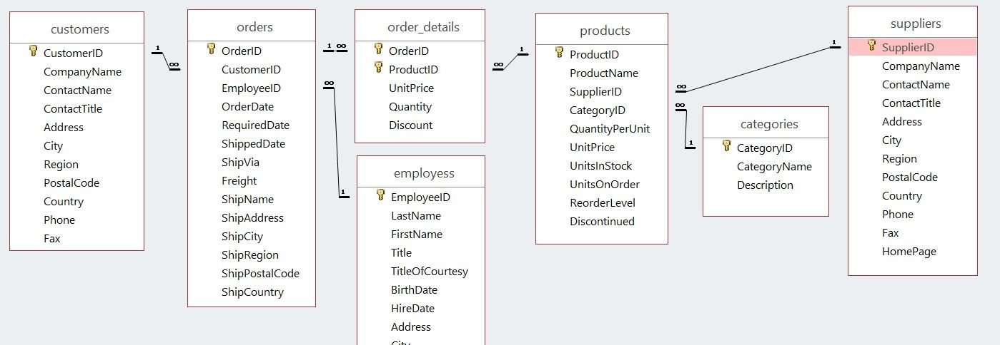

# Microsoft Power BI Introduktion

## Power BI Desktop
På dette seminar kommer vi til at bruge både Power BI Desktop versionen og online versionen af Power BI.

For at få det optimale ud af dette seminar skal du have følgende:

- Online adgang til Power BI - Standard adgang er nok
- Windows pc med Power BI desktop installeret
- Windows pc med Silverlight installeret (Bruges af Power View i Excel)

Power BI Desktop
Du kan hente Microsoft Power BI Desktop på denne side:
https://aka.ms/pbiSingleInstaller 
System krav er følgende:
Windows 10, Windows 7, Windows 8, Windows 8.1, Windows Server 2008 R2, Windows Server 2012, Windows Server 2012 R2
Power BI Desktop kan hentes i en 32-bit eller en 64-bit version.

## Hvad er Power BI
Power BI er en samling af softwaretjenester, apps og forbindelser, der arbejder sammen for at forvandle usammenhængende data til faste, visuelt fordybende og interaktive indsigter.

Uanset om dataene er et enkelt Excel-regneark, cloud baserede data eller lokale data, så giver Power BI dig let adgang til at oprette forbindelse til dine datakilder, visualisere vigtige elementer og dele indholdet.

Power BI er i stand til at oprette hurtige indsigter ud fra et Excel-regneark eller en lokal database. Men Power BI er også et robust program i virksomhedsklassen, der er klar til omfattende udformning og realtidsanalyser samt tilpasset opbygning. 

Det kan dermed være både et personligt rapporterings- og visualiseringsværktøj samt fungere som et analyse- og beslutningsprogram bag gruppeprojekter, divisioner eller hele virksomheden.

### Power BI Programmer 
Power BI består af tre programmer: 

- Power BI Desktop - Windows
- Power BI Online - SAAS
- Power BI Mobil

som alle arbejder sammen, så du kan oprette, interagere med, dele og forbruge dine data, som du ønsker det.

## Data
På dette seminar bruger vi nogle eksempel data:

Northwind - Microsoft eksempel data
* Excel format
* CSV format
* Access Format 

### ER-diagram
Et ER-diagram hjælper dig med at få oversigt over relationerne mellem dine data.

Dette er over Northwind, som er en Microsoft eksempeldatabase.

## Workflow
Som regel starter arbejdsgangen i Power BI i Power BI Desktop, hvor du opretter en rapport. 
Rapporten udgives derefter i Power BI-tjenesten og deles, så brugerne af Power BI Mobile kan se oplysningerne.

Måske får du få vist lager- og produktionsgangen i et dashboard og bruger Power BI Desktop til at oprette rapporter til dit eget team baseret på statistikker over kundeengagement. 

Din brug af Power BI vil være baseret på hvilken funktion eller tjeneste i Power BI, der passer bedst til situationen, men hver del af Power BI er tilgængelig for dig på en særdeles fleksibel og avanceret måde.

### Flow
Det gængse flow for aktiviteter i Power BI:

- Overfør data til Power BI Desktop og opret en rapport
- Publicer til Power BI-tjenesten, hvor du kan oprette nye visualiseringer eller oprette dashboards
- Del dine dashboards med andre, især personer, der er på farten

## Komponenterne i Power BI
Alle funktionerne i Power BI kan brydes ned til nogle få grundlæggende komponenter:

* Visualiseringer
* Datasæt
* Rapporter
* Dashboards
* Felter

### Visualiseringer
En visualisering er en visuel gengivelse af dine data, f.eks. et diagram, en graf, et farvekodet kort eller andre interessante ting, du kan lave for at vise dine data visuelt. 

Power BI indeholder mange forskellige visualiseringstyper og flere kommer til hele tiden. Det følgende billede viser en samling af forskellige visualiseringer, der er blevet oprettet i Power BI-tjenesten.

Visualiseringer kan være enkle – f.eks. et enkelt tal, der repræsenterer noget væsentligt, eller de kan være visuelt mere komplekse.

Målsætningen med et visuelt element er at præsentere data på en måde, der giver kontekst og indsigt, hvilket kan være svært at tyde ud fra rå data.

### Datasæt
Et datasæt er en samling af data, som Power BI bruger til at oprette visualiseringer.
Du kan have et simpelt datasæt baseret på en enkelt tabel fra en Excel-projektmappe – svarende til det viste i det følgende billede.

Datasæt kan være en kombination af mange forskellige kilder, som du kan filtrere og kombinere, så det viser et datasæt til brug i Power BI.

Power BI har mange medfølgende datatilslutninger. Uanset om dine data er i Excel eller en SQL-database, er i en online tjeneste som f.eks. Facebook, Salesforce eller MailChimp, så har Power BI indbyggede datatilslutninger.

Når du har et datasæt, så kan du begynde at oprette visualiseringer.

### Rapporter
En rapport er en samling visualiseringer, der vises på én eller flere sider. 

Rapporter giver dig adgang til at oprette flere visualiseringer på mange forskellige sider.

### Dashboards
Når du vil dele en enkelt side af en rapport, eller dele en samling af visualiseringer, så skal du oprette et dashboard. 

Et dashboard i Power BI består af en samling af visuelle elementer fra en enkelt side, som du vil dele med andre. 
Et dashboard skal kunne være på én side

### Felter
I Power BI er et felt en enkelt visualisering, der findes i en rapport eller på et dashboard.

Når du opretter en rapport eller et dashboard, kan du flytte rundt på dine felter alt efter, hvordan du vil præsentere dine oplysningerne. 

## Opret Dashboards med Online-programmet
Du opretter forbindelse til data fra Power BI ved at vælge knappen Hent data nederst til venstre på startskærmen.

Ud over gængse datakilder som f.eks. Excel-filer, databaser eller Azure-data, kan Power BI oprette forbindelse til online eller cloud-tjenester som f.eks. Salesforce, Facebook, Google Analytics.

Du kan vælge mellem:

* Find indhold
* Opret nyt indhold

### Find indhold
Find indhold giver dig mulighed for at hente og se indhold, som andre i din virksomhed har oprettet eller bruge nogle af de indbyggede Tjenester, der indeholder færdiglavede visuelle elementer, der allerede er arrangeret i dashboards og rapporter.

For at bruge de indbyggede tjenester skal du have en Pro licens.

### Opret nyt indhold
Du har mulighed for at oprette forbindelse til:

* Filer - f.eks. Excel, CSV
* Databaser - f.eks. Microsoft SQL databaser

## Power BI Desktop
Power BI Desktop er et program beregnet til at oprette forbindelse til, rense og visualisere dine data. 

Du kan installere Power BI Desktop som en applikation fra Windows Store, eller du kan downloade den fra Power BI-tjenesten. 

Fra Power BI vælger du pil ned-knappen øverst til højre i Power BI og derefter vælger Power BI Desktop.

Der er tre visninger i Power BI Desktop: 

1. Rapport
2. Data
3. Model (Relationer)

Power BI Desktop indeholder også Query Editor, som åbnes i et separat vindue. 
I Query Editor kan du oprette forespørgsler og transformere data. 
Derefter indlæser du denne tilpassede datamodel i Power BI Desktop og opretter rapporter.

### Forbindelse til data
Når du har installeret Power BI Desktop, kan du oprette forbindelse til mange forskellige datakilder.

Du skal bare vælge – **Start – Hent data**

